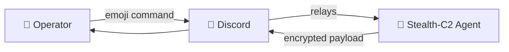

# 🥷 Stealth-C2

> **⚠️ Disclaimer:** For educational purposes and authorized security testing only. The author takes no responsibility for misuse.

**Stealth-C2** is a lightweight, cross-platform Command & Control (C2) agent built on top of the Discord API. It blends C2 traffic with normal HTTPS traffic on port 443, bypasses conventional firewall restrictions, and uses emoji-based steganography so commands look indistinguishable from ordinary chat messages.

---

## Features

### 🔐 Operational Security
- **Steganographic protocol** — commands are emoji-encoded; no plaintext command strings ever appear in chat.
- **Anti-analysis** — detects Wireshark, x64dbg, IDA, ProcMon, and sandboxes (Cuckoo, VirtualBox, VMware) at startup. Engages a kill switch if threatened.
- **Traffic blending** — all C2 traffic is HTTPS to `discord.com` (port 443), indistinguishable from normal browsing.

### 🔑 Key Management (v1.0)
- **No hardcoded secrets** — a cryptographically random AES-256 key is auto-generated on first run and saved to `~/.stealth_c2/key.bin` (chmod 0600).
- **Remote key rotation** — send `🔑` to instantly rotate the key. The old key is archived automatically so previously-exfiltrated files remain decryptable.
- **Key backups** — stored in `~/.stealth_c2/key_<timestamp>.bin.bak`.

### 📂 Secure Exfiltration
- Files are encrypted client-side with **AES-256-GCM** before upload, preventing DLP inspection of exfiltrated data.

### 👁️ Resilient Surveillance
- Smart capture: tries a native screen capture first (MSS), falls back to webcam (`fswebcam`) if the desktop is locked or running Wayland.

### 🔄 Persistence
- **Linux** — user-level `systemd` service (no `sudo` required).
- **Windows** — Startup folder injection.

---

## Architecture


```mermaid
graph LR
    Operator[👹 Operator] -- "emoji command" --> Discord[💬 Discord]
    Discord -- relays --> Agent[🤖 Stealth-C2 Agent]
    Agent -- "encrypted payload" --> Discord
    Discord --> Operator
```

---

## Setup

### Prerequisites
- Python 3.10+
- A Discord bot token

### 1. Clone
```bash
git clone https://github.com/haridevp/Stealth-C2.git
cd Stealth-C2
```

### 2. Install dependencies
```bash
pip install -r requirements.txt
```

### 3. Configure
Create `.env` in the project root:
```ini
DISCORD_TOKEN=your_bot_token_here
```

### 4. Run
```bash
python src/main.py
```

On first run the agent auto-generates `~/.stealth_c2/key.bin`. No manual key setup is needed.

### 5. Build standalone binary (optional)
```bash
pyinstaller --onefile --name agent src/main.py
```

---

## Command Reference

| Emoji | Command | Description |
|-------|---------|-------------|
| `🐚` | System Info | OS, hostname, architecture |
| `📸` | Surveillance | Screen capture → webcam fallback |
| `👋` | Ping | Liveness check |
| `📂 /path` | Exfiltrate | Upload AES-256-GCM encrypted file |
| `⚡ <cmd>` | Execute | Run arbitrary shell command (no-shell, injection-safe) |
| `🔄` | Persist | Install OS startup mechanism |
| `🔑` | Rotate Key | Generate new AES-256 key, archive old one |
| `🛑` | Kill Switch | Terminate agent immediately |

---

## Decrypting Exfiltrated Files

```bash
# Using the active key (default)
python decrypt_tool.py /path/to/file.enc

# Using a backup key (after key rotation)
python decrypt_tool.py --key-file ~/.stealth_c2/key_20260401T153000Z.bin.bak /path/to/file.enc
```

Backup keys are stored in `~/.stealth_c2/` and named `key_<ISO-timestamp>.bin.bak`.

---

## Legal & Ethical Notice

This project is a proof-of-concept for **educational purposes and authorized red team simulations only.** The techniques demonstrated (steganography, persistence, encrypted exfiltration) are intended to help security professionals understand attack vectors and improve defences.

**The developer assumes no liability for any misuse. You are responsible for ensuring your activities comply with all applicable laws.**

---

### Author
**Haridev P**
- [Portfolio](https://haridevp.dev)
- [LinkedIn](https://linkedin.com/in/haridevp)