# 🥷 Stealth-C2: Red Team Operations Framework

> **⚠️ DISCLAIMER:** This software is for **Educational Purposes and Authorized Security Testing ONLY.** The author takes no responsibility for misuse. Do not install this on systems you do not own or have explicit permission to test.

## 📡 Overview

**Stealth-C2** is a lightweight, cross-platform Command & Control (C2) agent that leverages the Discord API for stealthy communication. By using a legitimate high-reputation service as a proxy, the agent bypasses traditional firewall restrictions and keeps traffic blended with normal user activity.

Unlike basic reverse shells, Stealth-C2 employs **Steganographic Protocols** (Emoji-based commands), **AES-256 Encryption** for data exfiltration, and **Automated Failover Logic** to maintain situational awareness even in hardened environments (e.g., Wayland secure boot).

---

## ⚡ Key Features

### 🔐 Operational Security (OpSec)

- **Steganographic Command Protocol:** All C2 traffic is disguised as innocuous chat messages using an Emoji-to-Function mapping (e.g., `📸` triggers surveillance).
    
- **Anti-Analysis Module:** Automatically detects forensic tools (Wireshark, ProcMon) and sandbox environments (Cuckoo). Engages a "Kill Switch" if a threat is detected.
    
- **Traffic Blending:** Uses HTTPS (Port 443) via `discord.com`, making the traffic indistinguishable from normal browsing.
    

### 👁️ Resilient Surveillance

- **Smart-Capture Logic:** The agent intelligently detects the OS environment.
    
    1. Attempts **Native API Screenshot** (MSS/GDI).
        
    2. If blocked (e.g., Linux Wayland Security), it fails over to **Webcam Capture** (OpenCV/fswebcam).
        
    3. This ensures "eyes on target" even when screen recording is privileged.
        

### 📂 Secure Exfiltration

- **Military-Grade Encryption:** All exfiltrated files are encrypted client-side using **AES-256-GCM** before upload.
    
- **DLP Evasion:** Prevents Network DLP (Data Loss Prevention) systems from inspecting the content of stolen files.
    

### 🔄 Persistence & Control

- **Auto-Start:** Installs persistence mechanisms specific to the OS:
    
    - **Linux:** User-level Systemd Service (No Sudo required).
        
    - **Windows:** Startup Folder injection.
        
- **RCE (Remote Command Execution):** Execute arbitrary shell commands remotely.
    

---

## 🛠️ Architecture

```mermaid
graph LR
    Operator[👹 Red Team Operator] -- "Sends 📸" --> Discord[💬 Discord Servers]
    Discord -- "Relays Command" --> Agent[🤖 Stealth-C2 Agent]
    Agent -- "Uploads encrypted.png" --> Discord
    Discord -- "Displays File" --> Operator
```




---

## 🚀 Installation & Setup

### Prerequisites

- Python 3.10+
    
- A Discord Account & Bot Token
    

### 1. Clone the Repository

Bash

```
git clone https://github.com/haridevp/Stealth-C2.git
cd Stealth-C2
```

### 2. Install Dependencies

Bash

```
pip install -r requirements.txt
```

### 3. Configuration

Create a `.env` file in the root directory:

Ini, TOML

```
DISCORD_TOKEN=your_discord_bot_token_here
```

### 4. Build (Optional)

To compile the agent into a standalone executable (EXE/ELF):

Bash

```
pyinstaller --onefile --name agent --hidden-import mss --hidden-import cv2 src/main.py
```

---

## 🎮 Usage Guide (The Rosetta Stone)

Once the agent is running, control it via your Discord Server channel using these triggers:

|**Command**|**Emoji**|**Description**|
|---|---|---|
|**System Info**|`🐚`|Displays OS, Hostname, and Node architecture.|
|**Surveillance**|`📸`|Smart Capture: Tries Screen first, falls back to Webcam.|
|**Ping**|`👋`|Checks if the agent is alive and responsive.|
|**Exfiltration**|`📂`|`📂 /path/to/file` - Uploads an AES-Encrypted copy of the file.|
|**Execute**|`⚡`|`⚡ whoami` - Runs a terminal command and returns output.|
|**Persistence**|`🔄`|Installs the agent to Systemd (Linux) or Startup (Windows).|
|**Kill Switch**|`🛑`|Remotely terminates the agent process immediately.|

---

## 🔓 Decrypting Data

Files exfiltrated by the agent are encrypted with **AES-256**. To read them, use the provided tool:

1. Download the `.enc` file from Discord.
    
2. Run the decryptor:
    
    Bash
    
    ```
    python decrypt_tool.py
    ```
    
3. Drag and drop the file into the terminal when prompted.
    

---

## ⚠️ Legal & Ethical Notice

This project is a proof-of-concept created for **educational purposes and authorized red team simulations only.** The techniques demonstrated here (steganography, privilege escalation, and persistence) are intended to help security professionals understand attack vectors and improve defensive postures.
 **The developer assumes no liability and is not responsible for any misuse or damage caused by this program.** You are responsible for ensuring your activities comply with all applicable local, state, and federal laws 
---

### 👨‍💻 Author
**Haridev**
* [Portfolio](https://haridevp.dev)
* [LinkedIn](https://linkedin.com/in/haridevp)